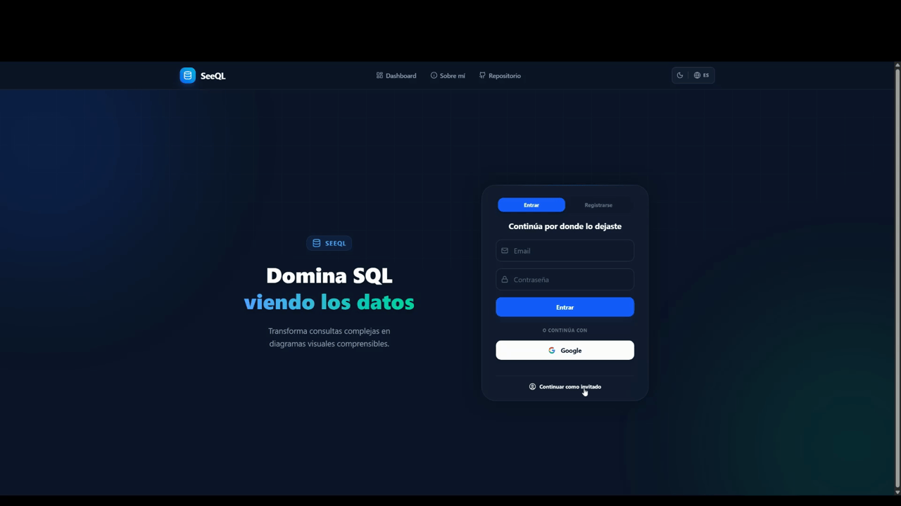
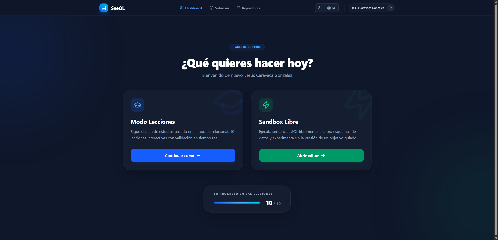
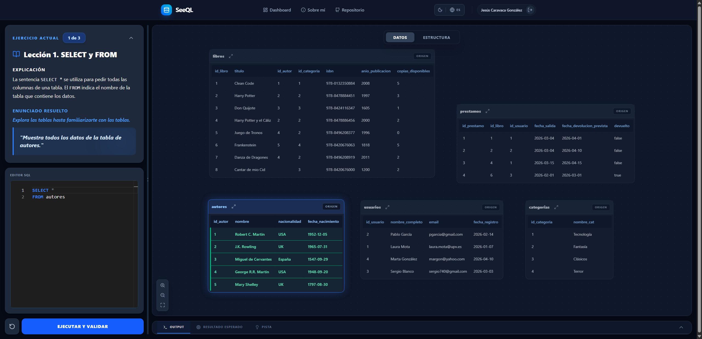
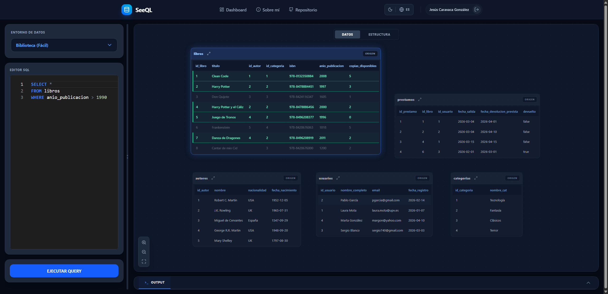
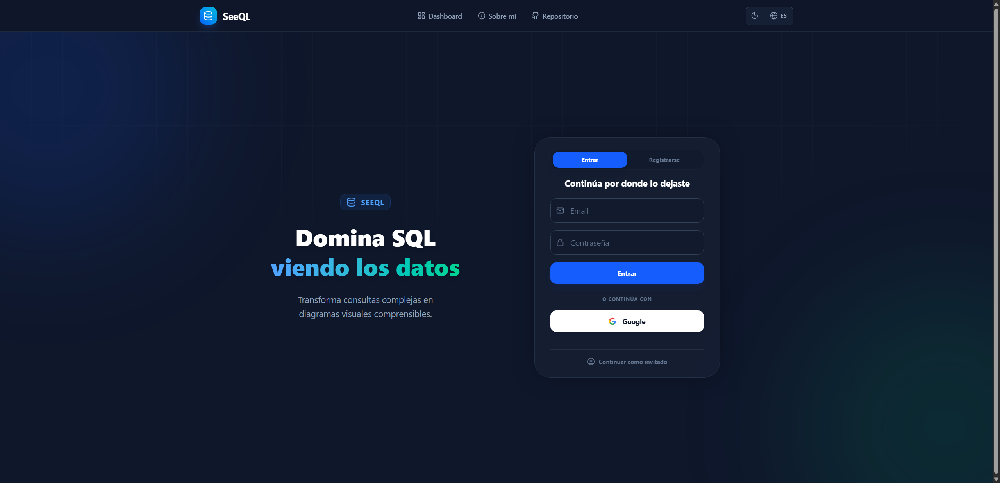
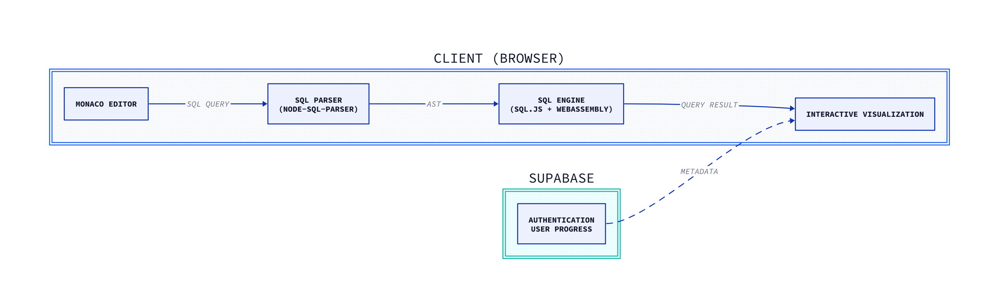

<div align="center">

# SeeQL

### Interactive SQL Learning & Visualization Platform

**Master SQL by seeing your data.**

Execute SQL queries directly in your browser and understand them through **real-time relational visualizations** powered by **WebAssembly**.

🎓 Developed as my **Bachelor's Thesis** at the **Universitat Politècnica de València (UPV)**

⭐ **Final Grade: 10/10 · Honors Recommendation**

<br>


<br><br>

[](https://see-ql.vercel.app)
[](https://youtu.be/lvYT9PO54WY)
[](./docs/thesis.pdf)

<br><br>

<p align="center">
  
</p>

</div>

---

# ✨ Features

- ⚡ Execute SQL queries entirely in the browser using **WebAssembly**
- 📊 Visualize relational transformations in real time
- 🎓 Learn SQL through guided interactive lessons
- 🧪 Experiment freely in a SQL sandbox
- 🔒 Safe client-side execution with no SQL server required
- ☁️ Authentication and progress persistence with Supabase
- 🚀 Instant query execution with zero network latency

---

# 📸 Screenshots

## Dashboard

Start your learning journey through guided lessons or experiment freely in the SQL sandbox.

<p align="center">

</p>

## Guided Lessons

Follow structured lessons with explanations, hints and real-time visual feedback.

<p align="center">

</p>

## SQL Sandbox

Write SQL freely and instantly visualize how your queries transform relational data.

<p align="center">

</p>

## Welcome Screen

Simple authentication with progress persistence across sessions.

<p align="center">

</p>

---

# 🏗 Architecture

SeeQL follows a **client-side architecture** where SQL parsing, execution and visualization happen entirely inside the browser.

React is responsible for the user interface, while **SQL.js** running through **WebAssembly** executes queries locally. **Supabase** is only responsible for authentication and user progress persistence.

<p align="center">

</p>

### Why this architecture?

- ⚡ Instant SQL execution
- 🔒 Safe experimentation
- 🌐 Minimal backend infrastructure
- 📉 Low latency
- 🧠 Immediate visual feedback for learning

---

# 🛠 Tech Stack

| Category | Technologies |
|-----------|--------------|
| **Frontend** | React · TypeScript · Vite |
| **SQL Engine** | SQL.js · WebAssembly |
| **SQL Parser** | node-sql-parser |
| **Editor** | Monaco Editor |
| **Backend Services** | Supabase |
| **Deployment** | Vercel |

---

# 🚀 Running locally

```bash
git clone https://github.com/MagicNube/SeeQL.git

cd SeeQL

npm install

npm run dev
```

---

# 📖 Documentation

The repository includes the complete Bachelor's Thesis covering:

- Software architecture
- Requirements analysis
- Technology decisions
- SQL execution engine
- Interactive visualization
- Educational design
- User evaluation
- Testing methodology

📄 **Technical Report:** [`docs/thesis.pdf`](./docs/thesis.pdf)

---

# 📄 License

MIT
